# A System and Method for Generating Number Sequences Based on Blockchain Hash Values

Yang Qi

2018.11 V2.0

yqhero@aliyun.com

**Abstract:** This paper proposes a method and system for generating random numbers at nearly zero cost by using blockchain hash values. The system is similar to drawing a specified number of numbered balls from a black box containing uniformly made balls. For example, in the Double Color Ball lottery, one blue ball is randomly selected from 16 blue balls and six red balls are selected from 33 red balls; automobile license-plate lotteries and prize drawings are similar scenarios. To make society believe that such processes are fair, government agencies and legal authorities often need to supervise or guarantee them. This creates high cost and low efficiency, and even then it cannot absolutely guarantee that every operation is fair and free from manipulation. By using the consensus properties of blockchains, we can satisfy this demand at low cost without relying on experts, government agencies, or authoritative organizations for supervision and guarantee. Everyone can verify the reasonableness of the result and form social consensus. This paper uses mathematical reasoning and statistical evidence to argue that each digit of a blockchain hash integer is independent and follows a uniform distribution. It then explains algorithms for generating number sequences from hash values and gives an application example based on Double Color Ball. The limitations of the system and corresponding solutions are also discussed, including the impact of 51% attacks and forks on this system. Considering these factors, the paper concludes that the system is feasible and implementable. The data, statistical programs, and results used in this paper are published at <https://github.com/mmmy/research_block>.

## Introduction

Random phenomena appear everywhere in social life. The simplest example is tossing a coin: when a normal coin is tossed in a normal way, the probability of heads or tails is 50%, which is already a social consensus. In card games such as Dou Dizhu, people agree to play because they believe every player has the same probability of receiving a particular card. In automobile license-plate lotteries, people believe the government is trustworthy. People buy lottery tickets because they believe every number has the same probability of appearing and that the process is fair. Some of these are consensus within small groups, while others require broad social consensus.

The problems are also obvious. Nobody can guarantee that a coin is truly uniform and normal. People may not notice whether someone has marked special cards. Whether a lottery or license-plate drawing has been manipulated may be unknowable. Even for lotteries, many people will say that something must be wrong behind the scenes. To gain social recognition, the operating cost is high: lottery drawings require live broadcast, notaries, and other supervisory institutions. The process is inefficient and cannot easily run at any time, such as once every hour.

We need an alternative system that solves the trust problem, the cost problem, and the efficiency problem at the same time. Modern computer networking, cryptography, and blockchain technology can satisfy this social demand well. Without institutional guarantees or notarization, everyone can verify the result through mathematics and computation. This system does not participate in blockchain computation, commonly called mining. It only needs to obtain information about a block generated at a specified height or time. These data are publicly available on the internet. Because everything is completed by computers, the system can run efficiently at any time.

## Blockchain

Since Satoshi Nakamoto published *Bitcoin: A Peer-to-Peer Electronic Cash System*, the Bitcoin blockchain has been running for nine years. Its purpose was to issue an electronic currency that does not require institutional issuance or authentication. Bitcoin has become a public, transparent, stable blockchain with high computing power and strong social recognition. From 2009 to the present, it has generated a block roughly every ten minutes. As of 2018-11-01, it had produced more than 500,000 blocks.

Its principle is that computer nodes distributed across the network freely participate in the proof-of-work process, packaging all transactions on the network during a period of time and calculating blocks through SHA-256 encryption. Every historical transaction can be traced on-chain. Although the well-known 51% hash-power attack can attack a blockchain, the cost is extremely high. In particular, as total network hash power increases, the attack cost rises dramatically. In addition, an attack can only rewrite recently generated blocks. Modifying blocks generated one day earlier is theoretically impossible. If an attacker keeps attacking continuously, the gambler's ruin principle described in Nakamoto's paper applies. Moreover, even if an attack occurs, the blockchain is not destroyed; someone may only achieve double spending. As long as computing nodes continue participating in the network, normal new blocks will be generated quickly.

Another issue is blockchain forks. For example, Bitcoin historically hard-forked and produced a side chain, splitting network consensus into two chains; the new chain is now BCH. This does not affect our system, because we can define a rule protocol, such as recognizing only the main chain. In fact, the system can also be extended by copying it and letting the copied system depend on the BCH chain, making hash values more abundant.

Similarly, we can use Ethereum, Litecoin, and other blockchains.

Information from these mainstream blockchains is public. A personal computer can obtain blockchain information in real time. The Bitcoin blockchain data used in this paper comes from <https://www.blockchain.com/api>. The statistical analysis in this paper was completed using Python and Node.js, and the relevant code is open source on GitHub.

## 3. Hash Encryption

Every blockchain block has a hash value. It is obtained according to the agreed algorithm protocol by encrypting submitted network transactions with SHA-256. The Bitcoin chain currently uses SHA-256, producing a 64-character hexadecimal string. For example, the hash of the first Bitcoin block is `000000000019d6689c085ae165831e934ff763ae46a2a6c172b3f1b60a8ce26f`. Because this system does not need to deeply study blockchain internals, algorithm details are not discussed here.

To understand the system, we need the following points:

1. SHA-256, SHA-512, and similar encryption algorithms are already implemented in computers. They are very fast and have the property that reverse computation and cracking are computationally infeasible.

2. The probability that different inputs produce the same encrypted result approaches zero.

3. The same input always produces exactly the same encrypted result.

4. Because of blockchain properties, the probability that a newly generated block hash is the same as a historical hash approaches zero. The 548,496 consecutive block hashes used in this paper contain no duplicates, supporting this point.

This paper treats a block hash as a 64-digit hexadecimal integer generated by a block. Because the first N zeroes of a proof-of-work block hash reflect the current mining difficulty, to maximize the use of every digit of the integer, we hash the block hash again using SHA-256 or SHA-512. After SHA-512, we obtain a 128-digit hexadecimal number. The reason for doing this is discussed below.

## 4. Statistical Evidence for Independence and Randomness

How can we prove that every face of a die appears with the same probability? Strictly speaking, this cannot be proven absolutely. There are two approximate methods. First, use a highly precise manufacturing device to make the die while the whole manufacturing process is supervised by regulators. Second, use statistics: roll the die 10,000 times, 100 million times, or more, and measure the frequency distribution of each face. If the error is below the expected threshold, we consider the die reasonable. This paper uses the second method: statistical argument.

**N independent events:** In mathematical language, this means defining an event that repeats independently with the same probability. For example, toss the same coin ten times; the probability of heads is the same each time, and the first result does not affect the probability of the second. Double Color Ball and lottery drawings are similar. This paper first assumes that, statistically, every digit of the hash integer we obtain is independent and unaffected by other digits, and that every digit follows a uniform distribution. The following figure uses the hash value of the first Bitcoin block as an example.

 Figure 4-1 Blockchain hash value, hashed again with SHA-256 and SHA-512

The newly generated SHA-256 value is also 64 hexadecimal digits, while SHA-512 is 128 hexadecimal digits. We assume that every digit of the SHA-256 and SHA-512 outputs of all generated and future blockchain hashes is independent and follows a uniform distribution over the set S = [0, 1, 2, 3, 4, 5, 6, 7, 8, 9, a, b, c, d, e, f].

Define P(X=i and Y=j), where X is the digit position, i in [1, ..., n], and n is the total number of digits (64 for SHA-256 and 128 for SHA-512). Y is the digit that appears at the position, with j in [0, ..., f]. The mathematical expectation under the hypothesis is P = 1/16 = 0.0625 for any X and Y.

Similarly, define P(X=i and Y1=j1 and Y2=j2), where Y1 and Y2 are any two column combinations. There are 16 x 16 combinations. We assume the probability of every combination is P = 1/16/16 = 0.00390625. According to probability theory, if P(Y1 and Y2) = P(Y1) x P(Y2), then Y1 and Y2 are independent events.

Computer programs can help us perform complex statistical research. This paper uses Python for statistical analysis. To assist the analysis, we first use a computer program to randomly generate uniformly distributed hash samples. This random sample is called the benchmark. We then compute statistical dimensions for both the real sample and the generated reference sample, and compare them to evaluate the blockchain hash sample. This makes the argument more persuasive.

This paper studies a total of 548,496 blocks as of 2018-11-03 05:45:10 Beijing time.

We also use a computer to generate 548,496 uniformly random 64-digit hash samples as a benchmark, denoted as reference sample SS.

The statistics cover three aspects: 1. frequency statistics for all characters; 2. frequency distribution of hexadecimal digits at each position (randomness test); 3. frequency distribution of every two-position combination (independence test). Detailed statistical results are published at <https://github.com/mmmy/research_block/results>.

The statistical indicators include digit frequency distribution P, maximum and minimum values of P, median, first quartile, third quartile, and the chi-square test probability for equal frequencies. The chi-square statistic is:

chi = $`X^{2} = \sum_{i = 1}^{k}\frac{\left( x_{i}\  - \ m_{i} \right)^{2}}{m_{i}}`$

Because the distribution is uniform, m has the same value for each category, and mi is the sample mean. The chi-square test also has a p-value. The p-value lies in [0, 1]; the closer it is to 1, the closer the distribution is to uniform. For details, see Wikipedia: <https://zh.wikipedia.org/wiki/P%E5%80%BC>.

This paper calculates the chi-square test using the Python scientific computing function `scipy.stats.chisquare`. Documentation: <https://docs.scipy.org/doc/scipy/reference/generated/scipy.stats.chisquare.html>.

### 4.1 Frequency Statistics for All Characters (Overall Statistical Test)

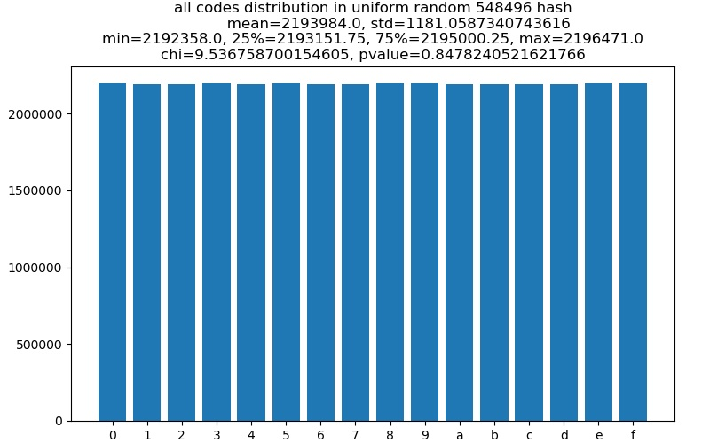

> Figure 4-2 Benchmark: frequency distribution of hexadecimal characters in 548,496 uniformly generated random hash values

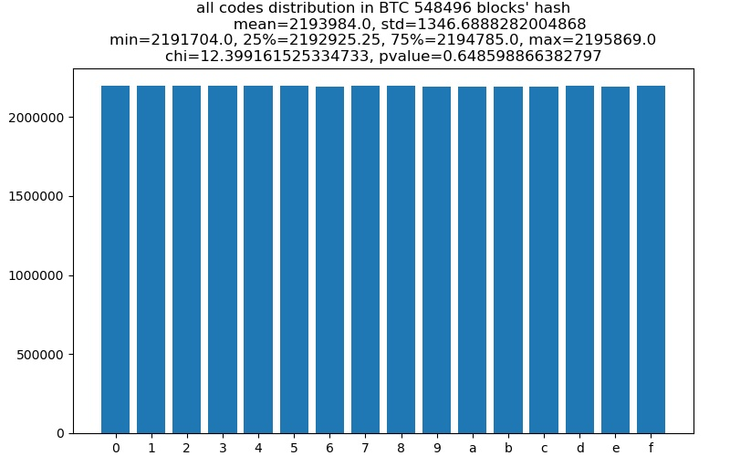

> Figure 4-3 Frequency distribution of hexadecimal characters in 548,496 Bitcoin hash values

Figure 4-2 shows the digit distribution from 548,496 uniformly random computer-generated hash values. Comparing Figure 4-3 with Figure 4-2, the overall probabilities of the sixteen characters from 0 to f are all very even, and the frequencies are very close to 1/16 = 0.0625. The fluctuation in Figure 4-3 is slightly larger than in Figure 4-2, but it still fits the overall characteristics of a uniform distribution.

### 4.2 Hexadecimal Character Distribution at Each Digit Position (Position Statistical Test)

Here we analyze SHA-256 hash values. Each hash has 64 hexadecimal characters. We separately count the frequency distribution of hexadecimal characters at each position. X represents the digit position from left to right.

First, we count the benchmark SS sample generated by the computer.

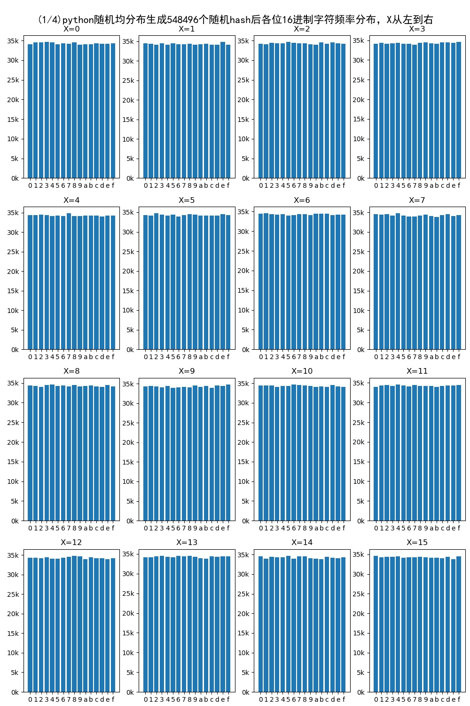

> Figure 4-4 Frequency distribution of hexadecimal characters in benchmark SS hash values

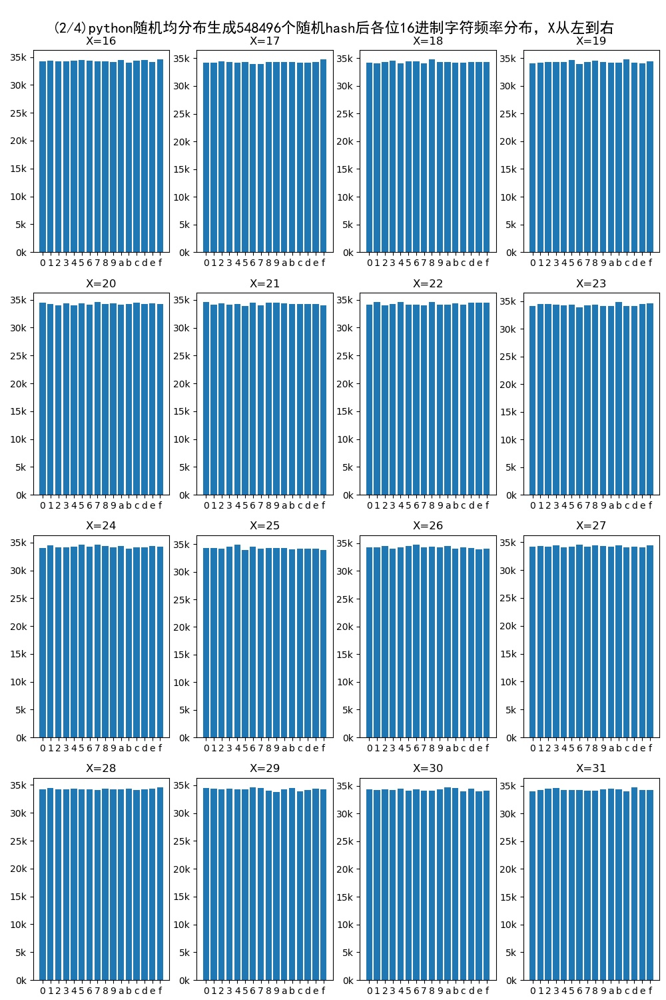

> Figure 4-5 Frequency distribution of hexadecimal characters in benchmark SS hash values 2

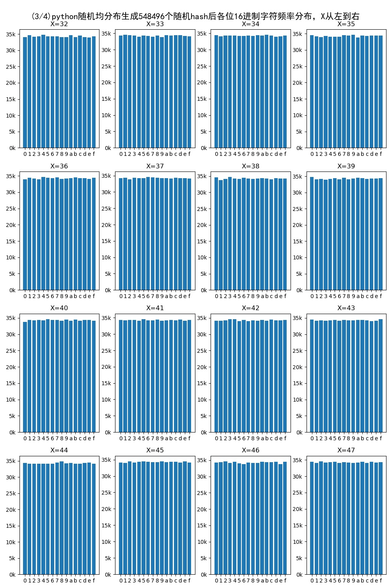

> Figure 4-6 Frequency distribution of hexadecimal characters in benchmark SS hash values 3

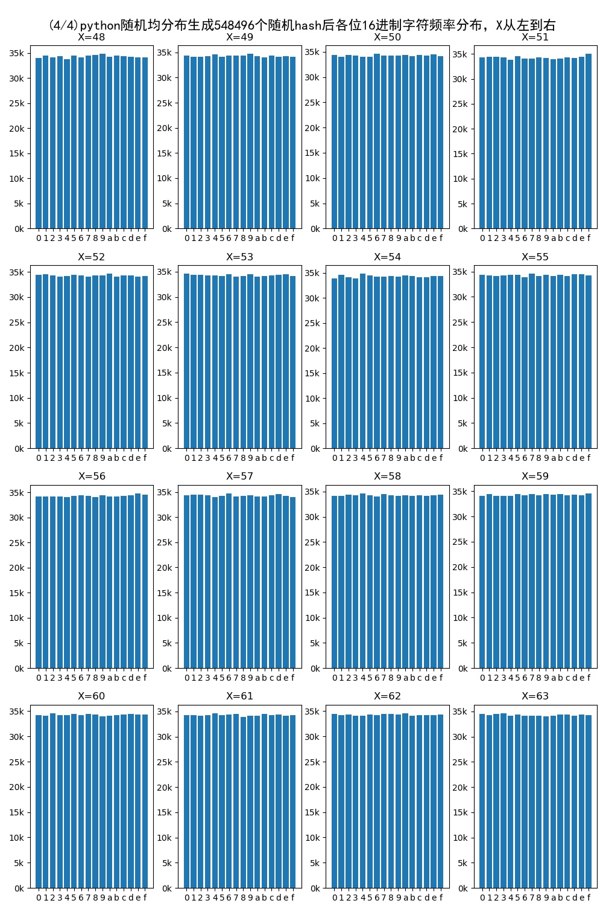

> Figure 4-7 Frequency distribution of hexadecimal characters in benchmark SS hash values 4

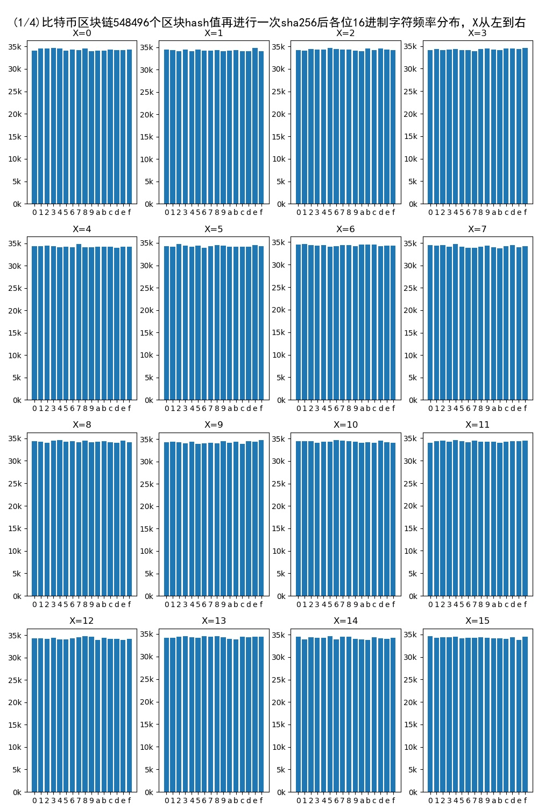

> Figure 4-8 Frequency distribution of hexadecimal characters in Bitcoin blockchain hashes after SHA-256, sample 1

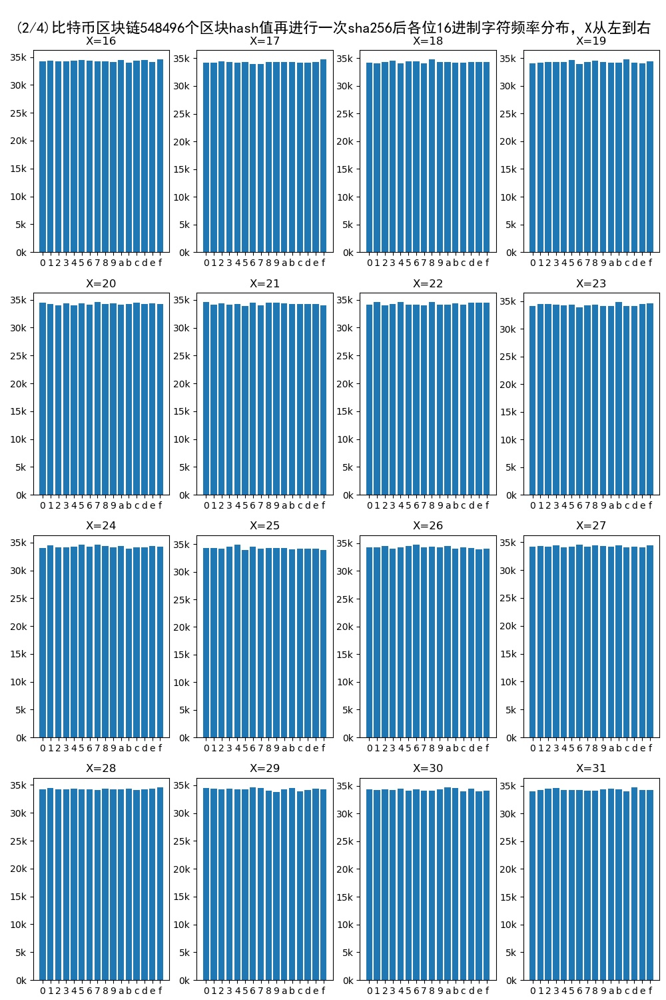

> Figure 4-9 Frequency distribution of hexadecimal characters in Bitcoin blockchain hashes after SHA-256, sample 2

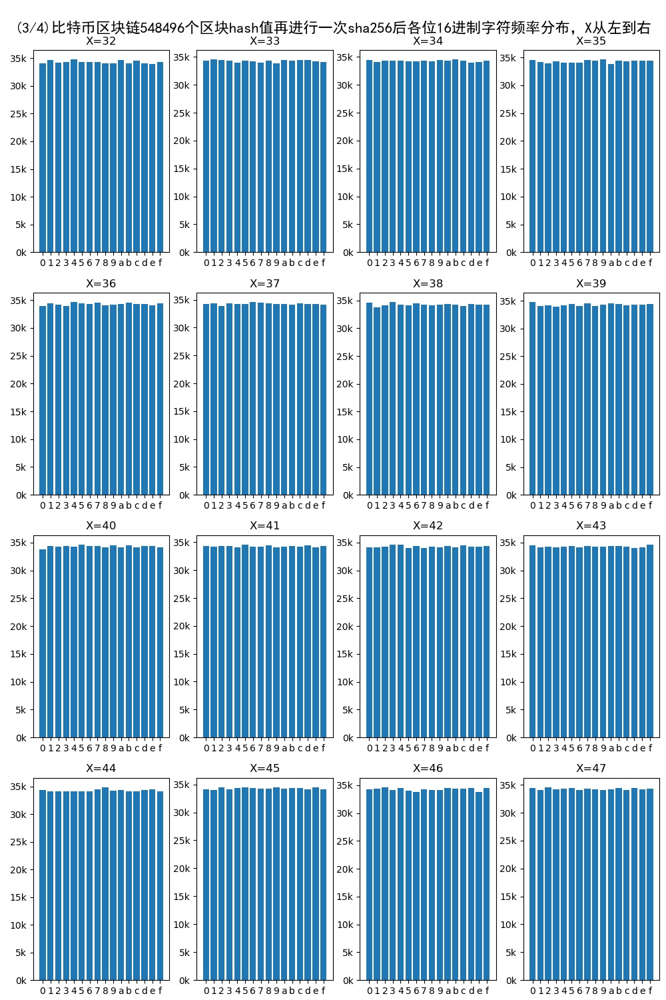

> Figure 4-10 Frequency distribution of hexadecimal characters in Bitcoin blockchain hashes after SHA-256, sample 3

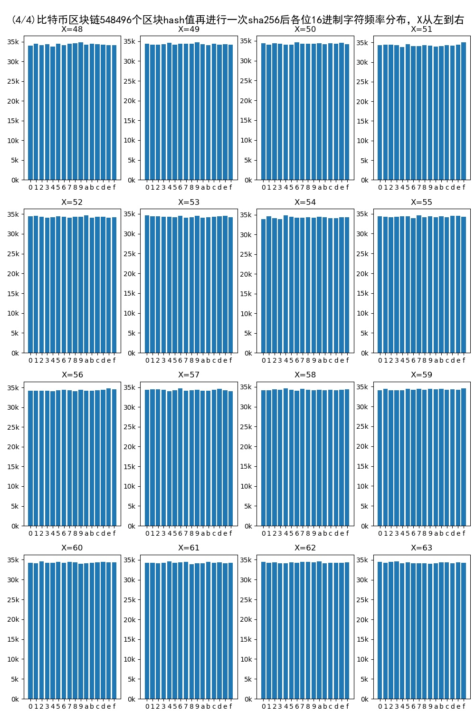

> Figure 4-11 Frequency distribution of hexadecimal characters in Bitcoin blockchain hashes after SHA-256, sample 4

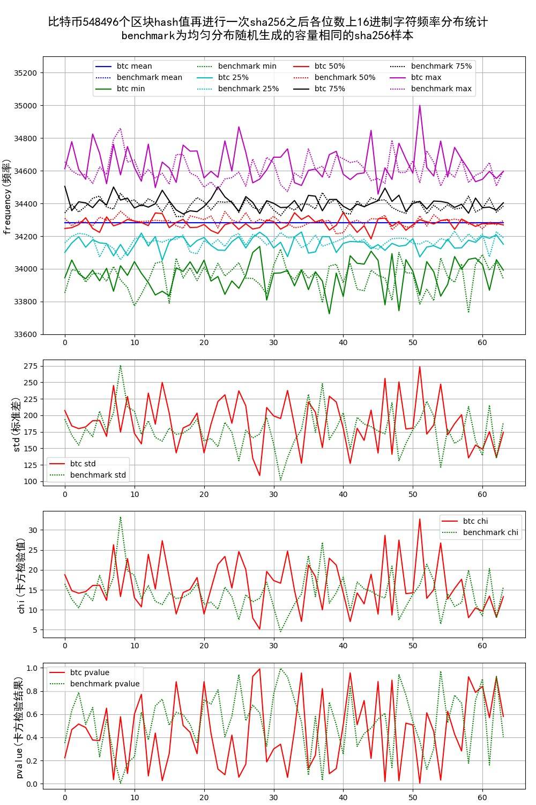

> Figure 4-12 Comparison between Bitcoin blockchain hashes after SHA-256 and benchmark SS

Figures 4-4 to 4-7 show the benchmark position distributions, while Figures 4-8 to 4-11 show the Bitcoin blockchain position distributions. Figure 4-12 summarizes these figures. Dashed lines represent benchmark data, and solid lines represent Bitcoin blockchain data. Figure 4-12 shows that all statistical dimensions fluctuate within a certain range. The first thing to examine is the extreme values, maximum and minimum. If the minimum or maximum has an obvious deviation, the benchmark may have a problem. The figure shows no obvious deviation in extreme values. Next, we examine whether the Bitcoin blockchain data and benchmark data intertwine on the curves. This is obvious in the figure: every statistical dimension fluctuates around a central line with the benchmark, indicating that the two samples have almost the same characteristics. This verifies the earlier hypothesis that the distribution of hexadecimal characters at each position is uniform.

### 4.3 Distribution of Every Two-Digit Combination (Position Independence Test)

For every two positions in a 64-digit number, the number of ordered combinations is 64 x 63 = 4,032. The character combinations are 16 x 16 = 256. Here we do not list the specific distribution for every two-position pair; only the final result is summarized.

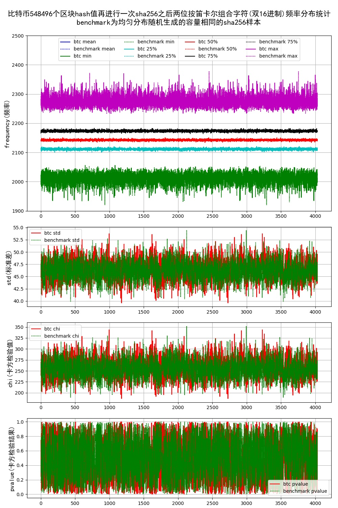

Figure 4-13 Comparison between Bitcoin blockchain hashes after SHA-256 and benchmark SS for every two-position combination

In Figure 4-13, dashed lines represent benchmark statistical distribution and solid lines represent Bitcoin blockchain statistics.

Similarly, in the frequency distribution of every two-position combination, there are 16 x 16 = 256 combinations. The result shows that every combination appears with a frequency very close to 548496/16/16 = 2142.5625, equivalent to a probability of 1/16/16. The statistical values for the Bitcoin blockchain fall in the same domain as the benchmark distribution.

We can therefore consider that the digit distribution in all historical hashes strongly matches the characteristics of independent uniform distribution. Accordingly, hashes of blocks that have not yet been generated are also considered to have this characteristic: every digit appears randomly and cannot be predicted. Only under this condition can we use future block hashes to generate number sequences, and the generated sequences will also have independent uniformly distributed digits.

## 5. Generating Number Sequences

Through statistical argument, the distribution of each digit in the newly generated hash values is within a specific error range and conforms to uniform distribution. The positions are independent and do not affect one another.

Similarly, if this value is converted into any base m, will every digit of the new number have the same characteristic? In fact, except for the highest digit of the new integer (if the new base has an integer-multiple relationship with 16, this digit does not need to be removed), the other digits are consistent with the characteristics argued above. We use proof by contradiction:

Assume that, after excluding the highest digit, some digit in the new base does not follow a uniform distribution. However, the new-base integer and the original hexadecimal integer are equal. Then at least one digit of the original hash integer would not conform to uniform distribution, contradicting the earlier argument. Therefore, the assumption does not hold.

 Figure 5-1 Example of base conversion for a large number

### 5.1 Sampling With Replacement

There are two common types of random-number generation needs. In one scenario, six balls are selected from 33 numbered balls, and each ball can be selected at most once, similar to Double Color Ball. In another scenario, replacement is allowed: after each ball is drawn, it is returned before the next draw. Abstractly, this is the problem of drawing N numbers from M numbers, either with or without replacement.

Figure 5-2 Two random-number drawing methods

For sampling with replacement, every number has the same probability of being selected each time. Therefore, we only need to convert the integer into base M and then take N digits from it according to the agreed order.

Figure 5-3 Reference algorithm for sampling with replacement

### 5.2 Sampling Without Replacement

For sampling without replacement, each draw is also an independent event, but after each draw the next draw must be taken from the remaining numbers. At most M numbers can be drawn. If x numbers have already been drawn, then each of the remaining M - x numbers has probability 1/(M - x) of being selected. Therefore, we first convert the integer into base M and take one digit, usually the last digit. Then we remove the selected digit, convert the remaining integer into base M - 1, and take another digit, again usually the last digit. After each draw, the remaining integer is converted into a base reduced by 1. Repeating this process yields a sequence of N non-repeating numbers, as shown in Figure 5-4. In computer implementation, the algorithm can be optimized as shown in Figure 5-5.

Figure 5-4 Reference algorithm 1 for sampling without replacement

For example, in Double Color Ball, one blue number must be randomly selected from 1 to 16, and six non-repeating red numbers must be selected from 1 to 33. The algorithm can work as follows: first convert the hash value into base 16 and take the last digit; then convert the remaining number into base 33 and take the last six digits.

Figure 5-5 Reference algorithm 2 for sampling without replacement

## 6. System Implementation

Figure 6-1 System implementation principle diagram

### 6.1 Processing the Original Hash: Fhash(hash) Function Protocol

The original block hash usually has specific characteristics. For example, in a proof-of-work blockchain such as Bitcoin, the first several digits of a block hash are zero because of mining difficulty. On the one hand, we can use another hash value of the block, such as the Merkle root hash, or some combination. On the other hand, we can use the properties of SHA encryption algorithms and process the original hash again to obtain a new hash:

Fhash(original hash) -> new hash

In general, we can perform a linear operation on the original hash and then apply a SHA algorithm:

**Fhash(hash) = SHA(hash \* a + b)**

For example, using SHA-512 with a = 2 and b = 1 gives:

**Fhash(hash) = SHA512(hash \* 2 + 1)**

In Chapter 4, the SHA algorithm used in the statistical proof process is SHA-256 with a = 1 and b = 0, meaning the original hash is directly processed with SHA-256.

### 6.2 Proving That Every Digit of the New Hash Is Independently and Uniformly Distributed

The purpose is to prove that the hash value we use is truly random and cannot be predicted by anyone. This is the foundation of the entire system. See Chapter 4 for the detailed argument.

### 6.3 Using Multiple Blocks to Generate More Random Numbers: C(hashes, J)

The number of digits in each block hash is finite. We can combine several consecutive blocks to extend the hash length and generate more random numbers. Combining J blocks into a longer hash value, denoted Hfinal, is called the Concat function protocol:

**Hfinal = C(hashes, J)**

In general, this function simply concatenates the results after processing each hash with **Fhash(hash)** in sequence.

How many blocks J are needed depends on the range of random numbers to be generated. Let the required final number of hexadecimal hash digits be **dfinal**, and let the number of hexadecimal digits generated by **Fhash(hash)** be k. Then:

J = $`\frac{d_{final}}{k}`$

### 6.4 Required Hash Length dfinal

In specific use cases, different forms of random-number combinations are required. For example, Double Color Ball draws six non-repeating numbers from 33 red balls and one number from 16 blue balls. In automobile license-plate lotteries, 100 non-repeating numbers may be drawn from 10,000 numbers. The abstract mathematical model has three parameters: whether replacement is allowed, drawing range, and drawing count. In this system, these are defined as Y(C, M, N), where C indicates replacement, M is the drawing range, and N is the drawing count. For example, Double Color Ball is expressed as $`Y = \lbrack Y(without replacement, 33, 6), Y(without replacement, 16, 1)\rbrack`$; drawing 100 non-repeating numbers from 10,000 is expressed as $`Y = \lbrack Y(without replacement, 10000, 100)\rbrack`$.

For the drawing function F(C, M, N), $`C \in \lbrack with\ replacement,\ without\ replacement\rbrack`$. When C = with replacement, drawing N numbers with replacement from M numbers is a repeated arrangement problem. Let the result be R = [X1, X2, ..., XN]. Treat R from left to right as an N-digit base-M integer R = X1X2...Xn. Its decimal form is R10 = X1 \* MN-1 + X2 \* MN-2 + ... + XN, where 0 <= R10 <= MN - 1. Converting R into hexadecimal using hex(decimal number), the corresponding hexadecimal number is R16 = hex(R10), where 0 <= R16 <= hex(MN - 1). Therefore, when C = with replacement, the minimum required hash length dfinal is the digit length of hex(MN - 1 - 0 + 1), namely dfinal = digit length of hex(MN). Equivalently, $`16^{d_{final}} = M^N`$, so dfinal = log16(MN) = N \* log16M.

When C = without replacement, drawing N numbers without replacement from M numbers, at most M can be drawn. This is a non-repeated arrangement problem. Let the result be R = [X1, X2, ..., XN], where all Xi are distinct. The process is:

When i = 1, the drawing set is S1 = [0, 1, 2, ..., M-1], with M possible choices. After drawing, R = [X1].

When i = 2, the drawing set is S2 = S1 - R, with M - 1 possible choices. After drawing, R = [X1, X2].

When i = 3, the drawing set is S3 = S2 - R, with M - 2 possible choices. After drawing, R = [X1, X2, X3].

...

When i = N, the drawing set is SN = SN-1 - R, with M - N + 1 possible choices. After drawing, R = [X1, X2, X3, ..., XN].

Therefore, the total number of combinations for R is M \* (M - 1) \* (M - 2) \* ... \* (M - N + 1) = $`\frac{M!}{(M - N)!}`$. The range of input hash values must contain this number of combinations, so $`16^{d_{final}} = \frac{M!}{(M - N)!}`$, giving dfinal = log16($`\frac{M!}{(M - N)!}`$).

Thus the function for solving dfinal is:

Dfinal(C, M, N) = $`\left\{ \begin{array}{r}
N*\log_{16}M\ \ \ (C = with\ replacement) \\
\log_{16}\left( \frac{M!}{(M - N)!} \right)\ \ (C = without\ replacement)
\end{array} \right.`$

For output combination Y = [F(C1, M1, N1), ..., F(Ci, Mi, Ni)], compute:

dfinal = Dfinal(C1, M1, N1) + ... + Dfinal(Ci, Mi, Ni) = $`\sum_{j = 1}^{i}{D_{final}(Cj,\ Mj,Nj)}`$

For Double Color Ball:

**dfinal** = $`\log_{16}\left( \frac{33!}{(33 - 6)!} \right)`$ + $`\log_{16}\left( \frac{16!}{(16 - 1)!} \right)`$ = 8.39. Rounding up, at least 9 hexadecimal digits are required.

### 6.5 Generating the Sequence: G(Y, Hfinal)

For output combination Y = [Y(C1, M1, N1), ..., Y(Ci, Mi, Ni)], denoted [Y1, Y2, ..., Yi], G(Y, Hfinal) decomposes Hfinal into the corresponding number sequences according to Y1, Y2, ..., Yi.

The overall algorithm for conversion function G(Y, hash) is: after drawing one sequence, use the remaining hash value to draw the next sequence, and repeat. The drawing subfunction is F(INT, Y(C, M, N)). The result for Yj is denoted Lj:

J = 1, parameter Y1 = Y(C1, M1, N1), INT1 = hash, L1 = F(INT1, Y1)

J = 2, parameter Y2 = Y(C2, M2, N2), INT2 = remaining hash after removing L1, L2 = F(INT2, Y2)

J = 3, parameter Y3 = Y(C3, M3, N3), INT3 = remaining hash after removing L1 and L2, L3 = F(INT3, Y3)

...

J = i, parameter Yi = Y(Ci, Mi, Ni), INTi = remaining hash after removing [L1, L2, ..., Li-1], Li = F(INTi, Yi)

The subfunction F(INT, Y(C, M, N)) uses the modulo method and has two cases.

When C = with replacement, as in Figure 5-3, convert INT into a base-M integer. Let the digit set be S = [g1, g2, g3, ..., gx]. Starting from the low-order digits, take N numbers to obtain SN = [gx, gx-1, gx-2, ..., gx-N+1]. The remaining set S - SN = [g1, g2, g3, ..., gx-N] forms the remaining base-M integer used to calculate the next sequence. In this way, generation of each sequence does not interfere with the others, and the original hash value is used as fully as possible. A computer implementation can be described as:

gx = INT mod M

INT subtracts gx and then divides by M

gx-1 = INT mod M

INT subtracts gx-1 and then divides by M

gx-2 = INT mod M

...

INT subtracts gx-N+2 and then divides by M

gx-N+1 = INT mod M

INT subtracts gx-N+1 and then divides by M

Return SN = [gx, gx-1, gx-2, ..., gx-N+1] and the remaining INT value.

When C = without replacement, as in Figure 5-5, after j numbers have already been drawn, the next draw must be from the remaining M - J numbers. Number these M - J numbers in ascending order from 1 to M - J. This means drawing a number e from [1, 2, 3, ..., M - j] and using e to index into the original set, thereby selecting one original number.

Given M, set the original symbol set S = [s1, s2, s3, ..., sM]. Let its length be lenS. Let the drawing result set be SN. S[i] is the i-th value in S, where 0 <= i <= lenS - 1.

First draw: mod1 = INT mod M, g1 = S[mod1], SN = [g1]

INT subtracts g1 and then divides by M

Remove g1 from S, keep the relative order of the other characters, and reduce the set length by 1.

Second draw: mod2 = INT mod (M - 1), g2 = S[mod2], SN = [g1, g2]

INT subtracts g2 and then divides by M - 1

Remove g2 from S, keep the relative order of the other characters, and reduce the set length by 1.

...

N-th draw: modeN = INT mod (M - N + 1), gN = S[modeN], SN = [g1, g2, ..., gN]

INT subtracts gN and then divides by M - N

Return SN and the remaining INT value.

## 7. System Limitations and Solutions

No matter how many consecutive blocks are used, the maximum number of random numbers that can ultimately be generated is finite. It depends on the specific drawing base and whether the drawing is with or without replacement. For the same base, sampling with replacement requires more digits than sampling without replacement when the same count is drawn.

If a larger base or more random numbers are needed, multiple consecutive blocks can be used. SHA-512 can also be used to process the original hash and obtain more hash digits.

According to Sections 6.3 and 6.4, we can calculate the implementation method for a specific requirement. For example, if 1,000 consecutive blocks are needed, and the Bitcoin blockchain generates about one block every 10 minutes, or about 144 blocks per day, then about seven days of data are required. In practice, very few requirements need such a large base, because the combined hash value from 1,000 blocks is almost astronomical. In most cases, only one or two blocks are sufficient. For example, almost all lottery numbers can be generated using one blockchain hash.

## 8. Practical Applications

Almost all lotteries draw a certain number of random numbers from specified ranges. More complex cases are simply different forms of combination Y. Therefore, this system can be used in any existing form of lottery industry. Similar industries that need random numbers can also use it.

### 8.1 Double Color Ball Application Example

From 2003 to 2018-11-15, Double Color Ball had produced 2,340 issues. The frequency distribution of red and blue balls is shown below.

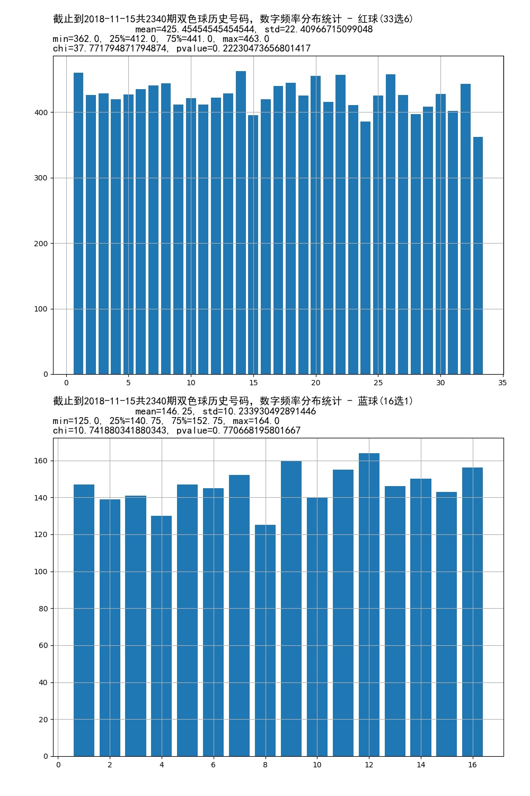

> Figure 7-1 Frequency distribution of red and blue ball numbers across 2,340 Double Color Ball issues

How can this system be used? First, define a rule, or protocol:

1. Specify which blockchain to use, such as Bitcoin, Bitcoin Cash, Litecoin, and so on.

2. Specify which block to use. For example, the current Double Color Ball drawing time is 21:15 every Tuesday, Thursday, and Sunday. The protocol can specify the first block after 21:15 on those days.

3. Define the output combination as Y = [(without replacement, 33, 6), (without replacement, 16, 1)].

4. Compute **dfinal** = $`\log_{16}\left( \frac{33!}{(33 - 6)!} \right)`$ + $`\log_{16}\left( \frac{16!}{(16 - 1)!} \right)`$ = 8.39, rounded up to 9.

5. Since 9 < 64, use J = 1 blockchain block.

6. Define **Fhash(hash) = SHA256(hash \* 1 + 0)**, meaning the original hash is processed once with SHA-256, and this rule is publicly declared so anyone can verify the correctness of the result.

7. Define **C(hashes, J) = C(hash, 1) = {return the input hash}**.

8. Then **Hfinal = SHA256(hash)**.

9. Generate the sequence according to **G(Y, Hfinal)**.

As an example, I use the following protocol to generate 2,340 red-blue number combinations:

1. Use the Bitcoin blockchain.

2. Starting from block 0, take one block every 150 blocks, and select the most recent 2,340 blocks in the sample.

3. The algorithm is:

   1. Hash the original hash once with SHA-256 to obtain H.

   2. Use the sampling-without-replacement method. Each time, take the last digit of the integer. Draw 6 from 33 to obtain six red ball numbers.

   3. Use the remaining number and again apply sampling without replacement. Each time, take the last digit of the integer. Draw 1 from 16 to obtain one blue ball number.

The example Python code, results, and statistics are published on GitHub. The following is the statistical result of the generated numbers:

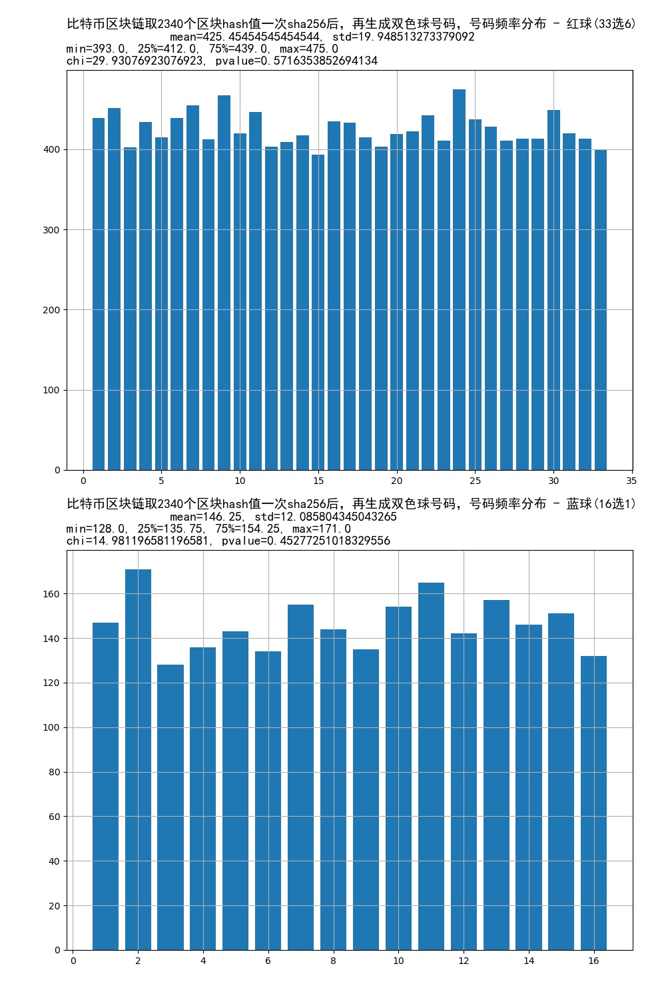

> Figure 7-2 Frequency distribution of red and blue ball numbers generated by Bitcoin blockchain hashes for 2,340 issues

Comparing Figure 7-2 with Figure 7-1, the statistical curves are very similar. Comparing the statistics, the red-ball p-value in Figure 7-2 is better than that in Figure 7-1, while the blue-ball p-value in Figure 7-1 is better than that in Figure 7-2. In fact, both Figure 7-1 and Figure 7-2 use only 2,340 samples, which is a relatively small sample size. Neither shows extreme behavior. This at least indicates that the proposed system can replace the existing mechanical system.

The following figure shows the number distribution when using 548,496 block hashes to generate 548,496 Double Color Ball issues.

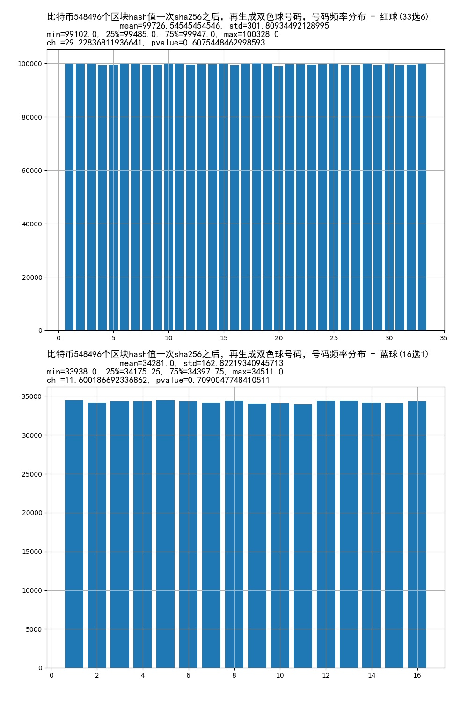

> Figure 7-3 Frequency distribution of red and blue ball numbers generated from 548,496 Bitcoin blockchain hashes

## 9. Conclusion

This paper proposes a system for obtaining random numbers. The system generates numbers using blockchain hash values. It requires almost no cost, no notary oath before drawing, and no third-party authority for guarantee. Everyone in the world can verify it. The system generates unpredictable random numbers in the future, and when the time for generating the random numbers arrives, the correctness of the result can be verified. This is the elegance of the system.

To argue that future numbers are genuinely random, we need to statistically analyze the distribution of past generated numbers. To assist the analysis, this paper uses computer programs to generate benchmark samples of the same size with uniform distribution. The results show that the statistical indicators support the claim that the random numbers generated by the proposed method conform to independent uniform distribution. The paper also gives two basic algorithms for generating random numbers from original hashes and uses proof by contradiction to argue that the generated numbers also satisfy independent uniform characteristics. In practical use of the system, this algorithm should be followed because it maximizes use of the original hash value. The paper also discusses system limitations and corresponding solutions. Finally, it provides an implementation example for Double Color Ball and statistically compares it with real Double Color Ball number distributions, further verifying the feasibility of the system. The system can be applied broadly to almost any industry that requires random numbers.

## References

[1] Satoshi Nakamoto, *Bitcoin: A Peer-to-Peer Electronic Cash System*, 2008.

